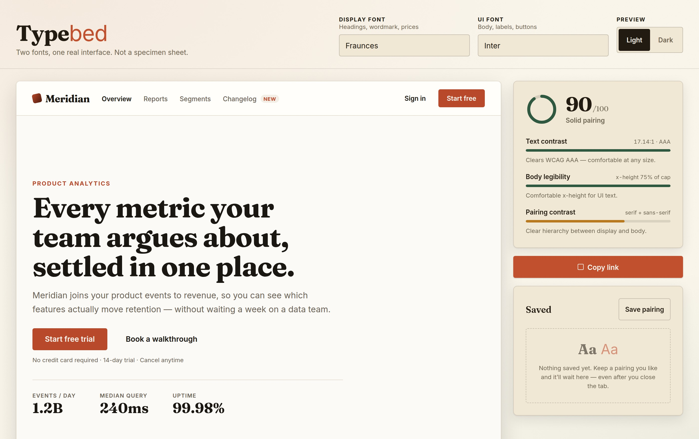

# Typebed

**▶ Live demo: [apps.charliekrug.com/typematch](https://apps.charliekrug.com/typematch/)**

[](https://github.com/ctkrug/typematch/actions/workflows/ci.yml)
[](LICENSE)

Pick two Google Fonts and see them doing real interface work: button labels, form fields, small
print, a pricing table. For designers and front-end developers choosing type for a real product,
before the fonts are wired into a codebase.



## Why

Every font-pairing tool shows you the same thing: a big headline over a paragraph of filler. That
view flatters almost everything. A typeface only shows its problems once it has to do small, dense,
unglamorous work: a 13px form label, a button caption, the fine print under a trial CTA, numerals in
a pricing card.

Plenty of pairs that look sharp as a specimen go soft at that size, and you tend to find out after
the fonts are already in the codebase. Typebed puts the pairing straight into a densely populated
product mock so you can see that in one glance instead of building it first.

## What you get

- **A whole fake product, not text samples.** A nav bar, a marketing hero with a stat row, a
  three-tier pricing grid, and a signup form with labels, helper text, an error state, and a
  disabled button. Small type is sized honestly at 12px to 13px, because that is where pairings
  fail.
- **A readability score out of 100, with its reasoning shown.** Text contrast (WCAG 2.x math), body
  legibility (measured x-height over cap-height), and pairing contrast (how far the two faces
  actually diverge). Each factor gets a plain-language verdict, not just a bar.
- **Measured, not curated.** Metrics come from the glyphs your browser rasterized, via canvas, so
  any pairing works. There is no lookup table of blessed combinations.
- **Flash-free swaps.** The current face keeps painting until the next one has downloaded, so
  changing a font never flashes a fallback.
- **Shareable links.** Both fonts and the preview theme live in the URL. Copy the address bar and
  the recipient sees exactly what you saw.
- **Saved pairings** in localStorage, kept in sync across tabs, plus a light/dark preview toggle.

## Try these

Each link opens the live app on that pairing, at the score it earns:

- [**Bebas Neue + Work Sans**](https://apps.charliekrug.com/typematch/?display=Bebas%20Neue&ui=Work%20Sans&theme=light)
  scores **100**. A condensed display face against a neutral sans: nothing competes.
- [**Fraunces + Inter**](https://apps.charliekrug.com/typematch/?display=Fraunces&ui=Inter&theme=light)
  scores **90**. The default pairing. Serif display, sans body, clear hierarchy.
- [**Oswald + Inter**](https://apps.charliekrug.com/typematch/?display=Oswald&ui=Inter&theme=light)
  scores **78**. Two sans faces that still work, because the widths sit far enough apart.
- [**Roboto + Open Sans**](https://apps.charliekrug.com/typematch/?display=Roboto&ui=Open%20Sans&theme=light)
  scores **72** and gets flagged as too alike. Both are humanist sans faces at similar widths, so
  headings stop separating from body copy.

## How the score works

| Factor           | Weight | Measured from                                               |
| ---------------- | ------ | ----------------------------------------------------------- |
| Text contrast    | 0.40   | WCAG 2.x contrast ratio of the preview's text vs background |
| Body legibility  | 0.30   | the UI font's rendered x-height ÷ cap-height                |
| Pairing contrast | 0.30   | how far the two faces' metrics and categories diverge       |

Contrast carries the most weight because it is the only factor with an objective pass or fail.

Only objective defects cap the overall score: text that fails WCAG, and the same family in both
slots. A healthy x-height should never average away text that fails WCAG. Legibility and pairing
contrast are heuristics, so they steer the number through their weight and explain themselves in the
breakdown, but they do not veto, because the metrics cannot see a typeface's skeleton. Oswald and
Inter is a genuinely good pairing that a naive "any weak factor caps it" rule condemns.

Where the glyphs cannot be measured at all, the score falls back to contrast-only and says so,
rather than inventing a number.

## Run it locally

```bash
npm install
npm run dev        # start the dev server
npm test           # run the suite (288 tests, no network needed)
npm run build      # production build to site/
npm run preview    # serve the built bundle
npm run typecheck  # tsc -b --noEmit
npm run lint       # eslint
npm run coverage   # v8 coverage report
```

The test suite injects its own font loader, so it never touches the network.

## Stack

- TypeScript and React, built with Vite
- Google Fonts CSS2 CDN for loading faces. No API key, no backend, no secrets.
- Vitest and React Testing Library, with property-based tests (fast-check) over the scoring math
- Static output, deployable to any host including a subpath

## Deploy

`npm run build` writes a self-contained static bundle to `site/`, which is committed so the
published directory is always the reviewed one. Vite uses a relative `base`, so it runs from a
domain root or any subpath (`example.com/typematch/`) with no rewrite rules.

## Docs

[`docs/ARCHITECTURE.md`](docs/ARCHITECTURE.md) maps the codebase and the three scoring rules that
are easy to break by accident. [`docs/VISION.md`](docs/VISION.md) covers the product thinking,
[`docs/DESIGN.md`](docs/DESIGN.md) the art direction, and [`docs/BACKLOG.md`](docs/BACKLOG.md) what
shipped and what was deliberately left out.

## License

MIT, see [`LICENSE`](LICENSE).

More of Charlie's projects → https://apps.charliekrug.com
